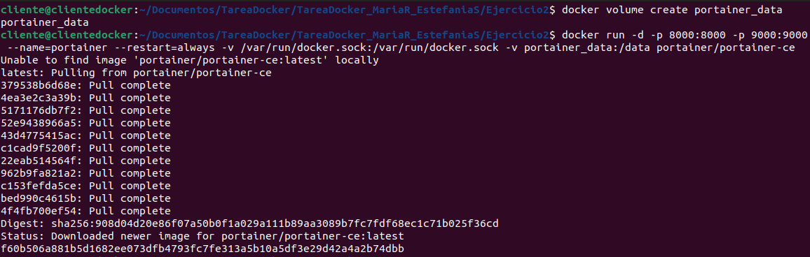
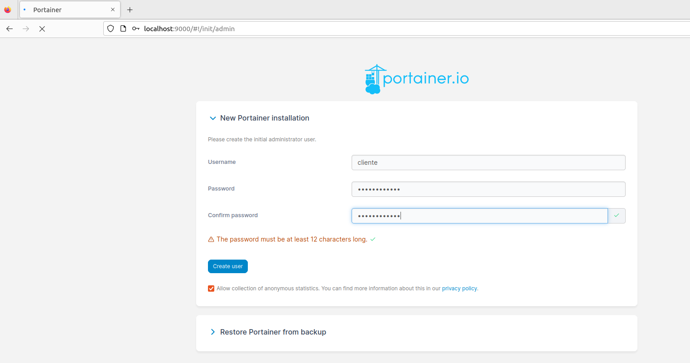
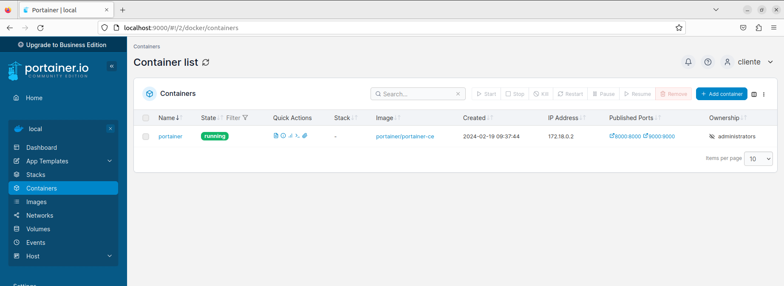
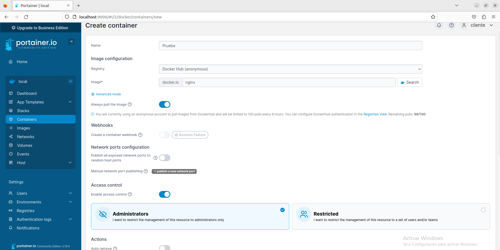
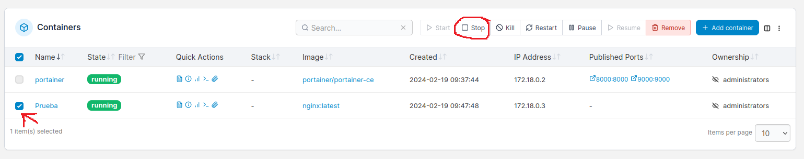
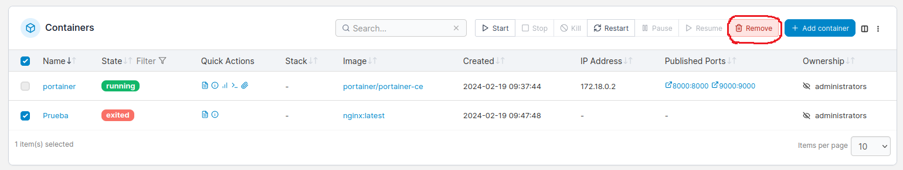
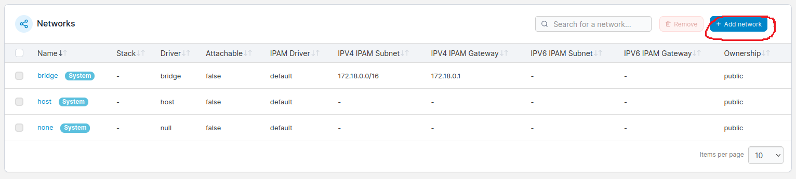
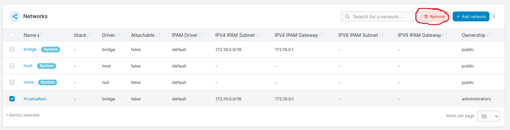
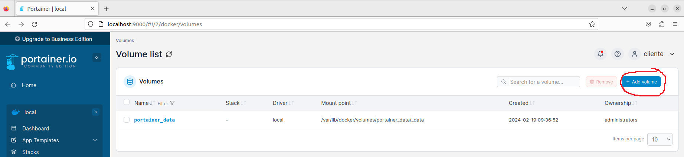
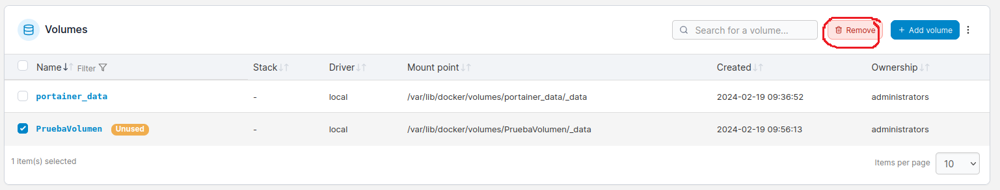

# Ejercicio 2 - Portainer

> Realizado por María Rosete y Estefanía Sastre

[TOC]

## Instalación de Portainer

```bash
$docker volume create portainer_data
$docker run -d -p 8000:8000 -p 9000:9000 --name=portainer --restart=always -v /var/run/docker.sock:/var/run/docker.sock -v portainer_data:/data portainer/portainer-ce
```



## Acceso a Portainer desde el navegador.



## Contenedores activos.



## Creación de un contenedor.



## Pausa del contenedor.



## Eliminación del contenedor.



## Creación de una nueva red.



## Eliminación de una red.



## Creación de un nuevo volumen.



## Eliminación de un volumen.

